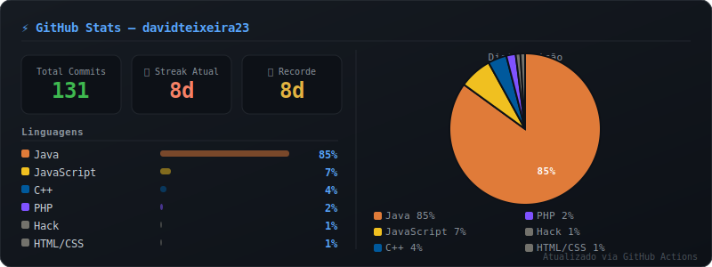

 Olá, eu sou o David Teixeira! 👋
const fetch = (...args) => import('node-fetch').then(m => m.default(...args));
const fs = require('fs');

### 🚀 Estudante de Desenvolvimento de Sistemas | Apaixonado por Dev & Eletrônica
const USERNAME = process.env.GITHUB_USERNAME || 'davidteixeira23';
const TOKEN = process.env.GITHUB_TOKEN;

Tenho 16 anos, moro em São Paulo e atualmente estou cursando o **2º ano do ensino médio integrado a Desenvolvimento de Sistemas**. Sou fascinado por lógica de programação, design de interfaces e computação física (IoT), buscando sempre aprender novas tecnologias e aplicar conceitos em projetos reais.
const HEADERS = {
  'Authorization': `Bearer ${TOKEN}`,
  'Content-Type': 'application/json',
};

- ⚡ Atualmente trabalhando em um **Projeto de Irrigação Automática** automatizado com sensores.
- 🎯 Focado em aprimorar minhas habilidades em backend, desenvolvimento mobile e lógica de programação.
// Cores por linguagem
const LANG_COLORS = {
  'Java': '#e07b39',
  'JavaScript': '#f0c020',
  'PHP': '#7F52FF',
  'HTML': '#e34f26',
  'CSS': '#1572B6',
  'Kotlin': '#A97BFF',
  'C++': '#00599C',
  'Python': '#3572A5',
  'TypeScript': '#2b7489',
  'Shell': '#89e051',
  'Other': '#73726c',
};

---
function color(lang) {
  return LANG_COLORS[lang] || LANG_COLORS['Other'];
}

### 🛠️ Tecnologias e Ferramentas
// ─── Busca dados via GraphQL ────────────────────────────────────────────────
async function fetchStats() {
  const query = `
    query($login: String!) {
      user(login: $login) {
        repositories(first: 100, ownerAffiliations: OWNER, isFork: false) {
          nodes {
            languages(first: 10, orderBy: {field: SIZE, direction: DESC}) {
              edges { size node { name } }
            }
            defaultBranchRef {
              target {
                ... on Commit {
                  history(first: 1) { totalCount }
                }
              }
            }
          }
        }
        contributionsCollection {
          totalCommitContributions
          contributionCalendar {
            totalContributions
            weeks {
              contributionDays {
                contributionCount
                date
              }
            }
          }
        }
      }
    }
  `;

Aqui estão as linguagens e ferramentas que estou aprendendo e utilizando nos meus estudos:
  const res = await fetch('https://api.github.com/graphql', {
    method: 'POST',
    headers: HEADERS,
    body: JSON.stringify({ query, variables: { login: USERNAME } }),
  });

| Categoria | Tecnologias |
| :--- | :--- |
| **Linguagens & Backend** |    |
| **Mobile & Banco de Dados** |   |
| **Web Frontend** |    |
| **Design & Hardware** |   |
  const json = await res.json();
  if (json.errors) {
    console.error('GraphQL errors:', JSON.stringify(json.errors, null, 2));
    process.exit(1);
  }
  return json.data.user;
}

---
// ─── Calcula streak ─────────────────────────────────────────────────────────
function calcStreaks(calendar) {
  const days = calendar.weeks.flatMap(w => w.contributionDays)
    .sort((a, b) => new Date(a.date) - new Date(b.date));

### 📌 Projetos em Destaque
  let currentStreak = 0;
  let longestStreak = 0;
  let tempStreak = 0;

* **🌱 Sistema de Irrigação Automática:** Projeto focado em automação residencial/IoT, utilizando sensores para monitorar a umidade do solo e realizar a rega automática de plantas de forma inteligente.
* **🚦 Protótipo de Semáforo Pedestre:** Projeto de computação física utilizando Arduino Nano e sensores de distância para controle de tráfego.
* **☕ Interfaces em Java:** Desenvolvimento de aplicações desktop explorando componentes gráficos e layouts dinâmicos com Java Swing.
* **💻 Desenvolvimento Web:** Criação de layouts responsivos estruturados com HTML/CSS e aplicações com lógica dinâmica em PHP e JavaScript.
  const today = new Date().toISOString().split('T')[0];

---
### 📊 Estatísticas do GitHub
  for (let i = 0; i < days.length; i++) {
    const day = days[i];
    if (day.contributionCount > 0) {
      tempStreak++;
      if (tempStreak > longestStreak) longestStreak = tempStreak;
    } else {
      if (day.date !== today) tempStreak = 0;
    }
  }

  for (let i = days.length - 1; i >= 0; i--) {
    const day = days[i];
    if (day.date === today && day.contributionCount === 0) continue;
    if (day.contributionCount > 0) currentStreak++;
    else break;
  }

### 📫 Como me encontrar
  return { currentStreak, longestStreak };
}

* 📧 E-mail: [davidpedreira250@gmail.com](mailto:davidpedreira250@gmail.com)
* 💼 LinkedIn: [linkedin.com/in/seu-usuario](https://linkedin.com/in/seu-usuario)
